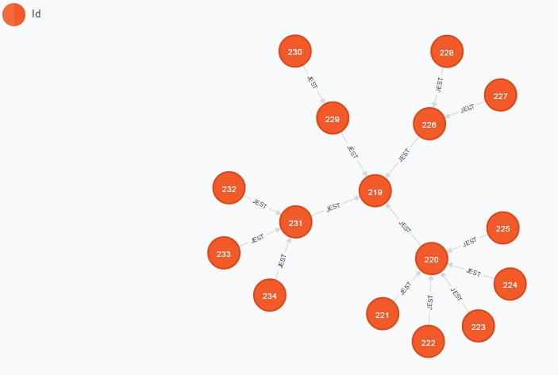

Neo4j
=====

### Stworzenie bazy

```
CREATE 
	(_1:Id {name:"Piwo"}),
	(_2:Id {name:"Lager"}),
	(_3:Id {name:"Mild Lager"}),
	(_4:Id {name:"Premium Lager"}),
	(_5:Id {name:"Marcowe"}),
	(_6:Id {name:"Oktoberfestbier"}),
	(_7:Id {name:"Kellerbier"}),
	(_8:Id {name:"Kozlak"}),
	(_9:Id {name:"Kozlak tradycyjny"}),
	(_10:Id {name:"Kozlak majowy"}),
	(_11:Id {name:"Porter"}),
	(_12:Id {name:"Brown Porter"}),
	(_13:Id {name:"Pilzner"}),
	(_14:Id {name:"Pilzner niemiecki"}),
	(_15:Id {name:"Pilzner czeski"}),
	(_16:Id {name:"Pilzner amerykanski"}),
	(_2)-[:JEST]->(_1),
	(_3)-[:JEST]->(_2),
	(_4)-[:JEST]->(_2),
	(_5)-[:JEST]->(_2),
	(_6)-[:JEST]->(_2),
	(_7)-[:JEST]->(_2),
	(_8)-[:JEST]->(_1),
	(_9)-[:JEST]->(_8),
	(_10)-[:JEST]->(_8),
	(_11)-[:JEST]->(_1),
	(_12)-[:JEST]->(_11),
	(_13)-[:JEST]->(_1),
	(_14)-[:JEST]->(_13),
	(_15)-[:JEST]->(_13),
	(_16)-[:JEST]->(_13)
```


### Wyswietlenie grafu

```
MATCH (n) RETURN n;
```



### Przyklady zapytan do bazy
#### Wyswietl jakie piwa naleza do jakiego rodzaju
Trzeba ustawic node_auto_indexing na true. [Instrukcja](http://neo4j.com/docs/stable/rest-api-configurable-auto-indexes.html)
```
START piwa=node:node_auto_index(name='Piwo')
MATCH piwa<-[:JEST]-typ<-[:JEST]-piwo
RETURN typ.name AS rodzaj, count(*) AS ilosc, collect(piwo.name) AS piwa
```


#### Pokaz piwa nalezace do pilzner
```
MATCH (pilzner { name:'Pilzner' })<-[r:JEST]-(piwa)
RETURN r
```


